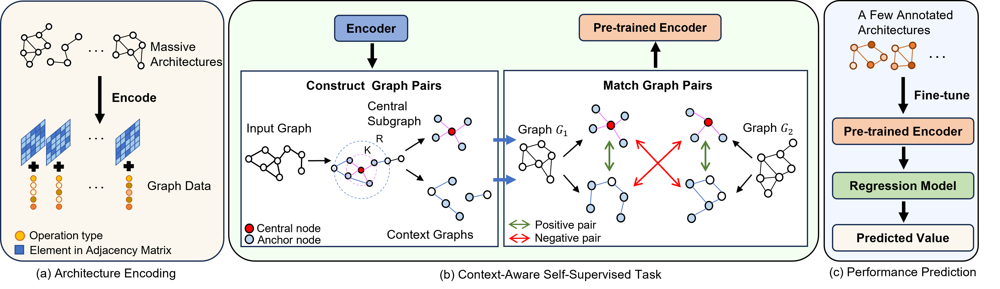

# CAP: A Context-Aware Neural Predictor for NAS (IJCAI24)

The implementation for CAP: A Context-Aware Neural Predictor for NAS (IJCAI24)

<p align="center">
    
</p>
<p align="center">
    The overview of CAP.
</p>

# Requirements 

```
python == 3.8
tensorflow == 2.2.0
torch == 2.0.1
torchvision == 0.15.2
torch-geometric == 2.3.1
```

# Data Preparation
Two datasets are required: NAS-Bench-101 and NAS-Bench-201. You can download these two datasets from the following links and put them under the folder *datasets*. 

**NAS-Bench-101:** 

project links:https://github.com/google-research/nasbench

dataset links:https://storage.googleapis.com/nasbench/nasbench_full.tfrecord

**NAS-Bench-201:**

project links:https://github.com/D-X-Y/NAS-Bench-201

dataset links:https://drive.google.com/file/d/16Y0UwGisiouVRxW-W5hEtbxmcHw_0hF_/view

# How to Use
## NAS-Bench-101
* We get the compressed NAS-Bench-101 file `nasbench.hdf5` using the script: `tfrecord_2_hdf5.py`
* Once you get `nasbench.hdf5`, you can randomly generate the training samples using the script: `make_splits.py`   

To pretrain CAP on NAS-Bench-101, you can run:
```shell
python pretrain_model.py --bench 101 --split 381262 
```
Then, you can get `Pretrain_101.pth` under the folder *wts*.  
To train CAP using NAS-Bench-101, you can run:
```shell
python train_model.py --bench 101 --train_split 100 --test_split all --loss bpr --is_pretrained True --pretrained_model wts/Pretrain_101.pth
```
To search for promising architectures on NAS-Bench-101, you can run:
```shell
python search_101.py --N 150 
```
## NAS-Bench-201
* `nasbench201_dict.npy` is generated using the script: `pth_2_npy.py`  
To pretrain CAP on NAS-Bench-201, you can run:
```shell
python pretrain_model.py --bench 201 --split 14063 
```
Then, you can get `Pretrain_201.pth` under the folder *wts*.  
To train CAP using NAS-Bench-201, you can run:
```shell
python train_model.py --bench 201 --dataset cifar10 --train_split 78 --test_split all --loss bpr --is_pretrained True --pretrained_model wts/Pretrain_201.pth
```
To search for promising architectures on NAS-Bench-201, you can run search_201.py:
```shell
python search_201.py --dataset cifar10 --N 150 
```
